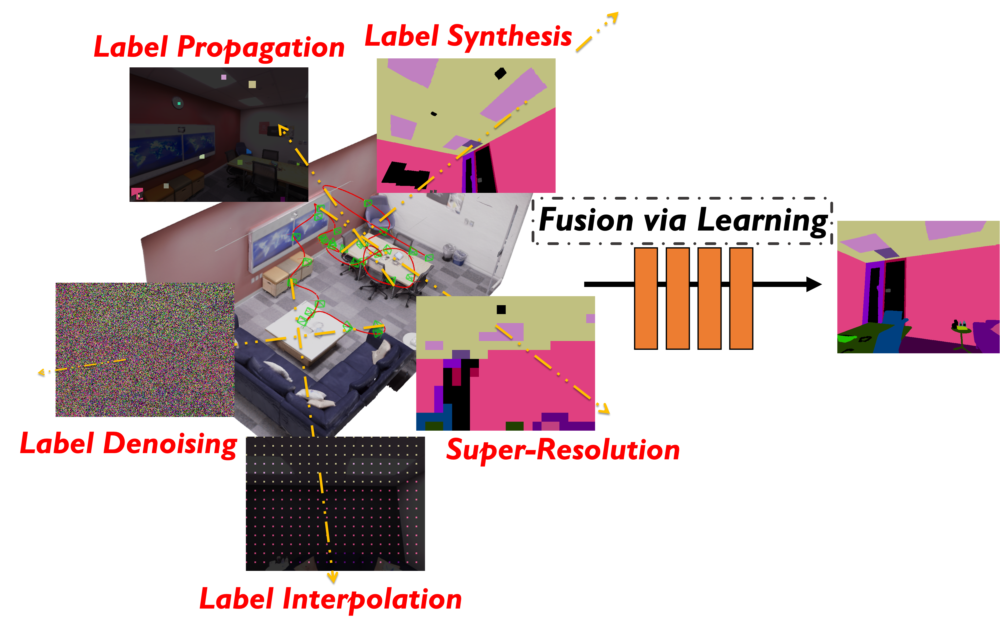
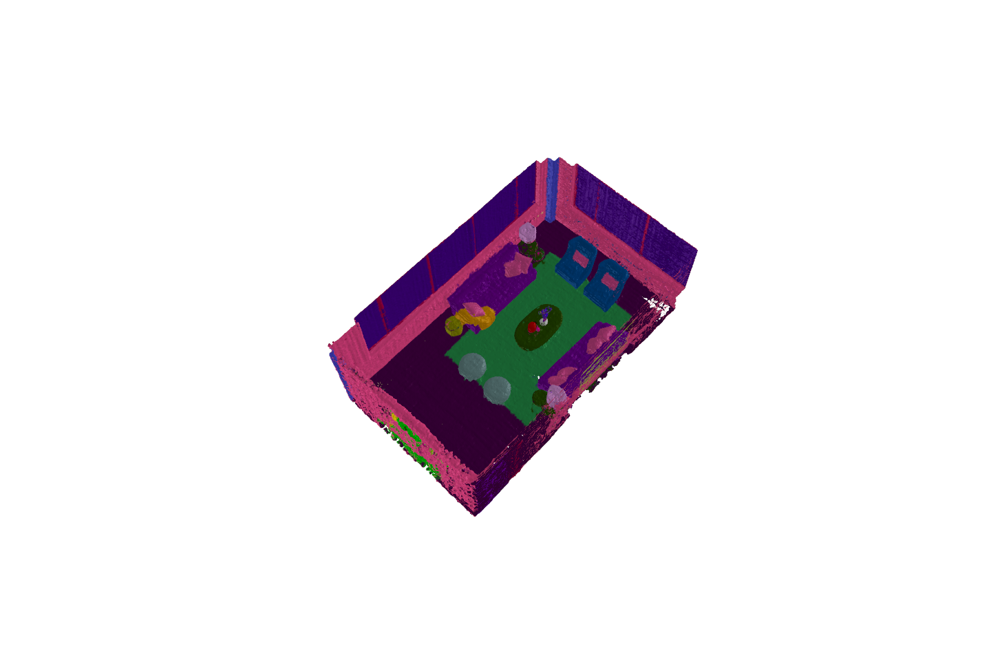

# Semantic-NeRF: Semantic Neural Radiance Fields

### [Project Page](https://shuaifengzhi.com/Semantic-NeRF/) | [Video](https://youtu.be/FpShWO7LVbM) | [Paper](https://arxiv.org/abs/2103.15875) | [Data](https://www.dropbox.com/sh/9yu1elddll00sdl/AAC-rSJdLX0C6HhKXGKMOIija?dl=0)


[In-Place Scene Labelling and Understanding with Implicit Scene Representation](https://shuaifengzhi.com/Semantic-NeRF/)  
 [Shuaifeng Zhi](https://shuaifengzhi.com/),
 [Tristan Laidlow](https://wp.doc.ic.ac.uk/twl15/),
 [Stefan Leutenegger](https://wp.doc.ic.ac.uk/sleutene/),
 [Andrew J. Davison](https://www.doc.ic.ac.uk/~ajd/),
 <br>
Dyson Robotics Laboratory at Imperial College \
Published in ICCV 2021 (Oral Presentation)



We build upon neural radiance fields to create a scene-specific implicit 3D semantic representation, Semantic-NeRF.

## Getting Started

For flawless reproduction of our results, the Ubuntu OS 20.04 is recommended. The models have been tested using Python 3.7, Pytorch 1.6.0, CUDA10.1. Higher versions should also perform similarly.

### Dependencies
Main python dependencies are listed below:
- Python >=3.7
- torch>=1.6.0 (integrate *searchsorted* API, otherwise need to use the third party implementation [SearchSorted](https://github.com/aliutkus/torchsearchsorted) )
- cudatoolkit>=10.1

Following packages are used for 3D mesh reconstruction:
- trimesh==3.9.9
- open3d==0.12.0

With Anaconda, you can simply create a virtual environment and install dependencies with CONDA by:
- `conda create -n semantic_nerf python=3.7`
- `conda activate semantic_nerf`
- `pip install -r requirements.txt`

## Datasets
We mainly use [Replica](https://github.com/facebookresearch/Replica-Dataset) and [ScanNet](http://www.scan-net.org/) datasets for experiments, where we train a new Semantic-NeRF model on each 3D scene. Other similar indoor datasets with colour images, semantic labels and poses can also be used.

### We also provide [pre-rendered Replica data](https://www.dropbox.com/sh/9yu1elddll00sdl/AAC-rSJdLX0C6HhKXGKMOIija?dl=0) that can be directly used by Semantic-NeRF.


## Running code
After cloning the codes, we can start to run Semantic-NeRF in the root directory of the repository.

#### Semantic-NeRF training
For standard Semantic-NeRF training with full dense semantic supervision. You can simply run following command with a chosen config file specifying data directory and hyper-params.
```
python3 train_SSR_main.py --config_file /SSR/configs/SSR_room0_config.yaml
```

Different working modes and set-ups can be chosen via commands:
#### Semantic View Synthesis with Sparse Labels:
```
python3 train_SSR_main.py --sparse_views --sparse_ratio 0.6
```
Sparse ratio here is the portion of **dropped** frames in the training sequence.

#### Pixel-wise Denoising Task:
```
python3 train_SSR_main.py --pixel_denoising --pixel_noise_ratio 0.5
```

We could also use a sparse set of frames along with denoising task:
```
python3 train_SSR_main.py --pixel_denoising --pixel_noise_ratio 0.5 --sparse_views --sparse_ratio 0.6
```

#### Region-wise Denoising task (For Replica Room2):
```
python3 train_SSR_main.py --region_denoising --region_noise_ratio 0.3
```
The argument **uniform_flip** corresponds to the two modes of "Even/Sort"in region-wise denoising task.

#### Super-Resolution Task:
For super-resolution with **dense** labels, please run
```
python3 train_SSR_main.py --super_resolution --sr_factor 8 --dense_sr
```

For super-resolution with **sparse** labels, please run
```
python3 train_SSR_main.py --super_resolution --sr_factor 8
```

#### Label Propagation Task:
For label propagation task with single-click seed regions, please run
```
python3 train_SSR_main.py --label_propagation --partial_perc 0
```

In order to improve reproducibility, for denoising and label-propagation tasks, we can also include `--visualise_save` and `--load_saved` to save/load randomly generated labels.


#### 3D Reconstruction of Replica Scenes
We also provide codes for extracting 3D semantic mesh from a trained Seamntic-NeRF model.

```
python3 SSR/extract_colour_mesh.py --sem --mesh_dir PATH_TO_MESH --mesh_dir PATH_TO_MESH  --training_data_dir PATH_TO_TRAINING_DATA --save_dir PATH_TO_SAVE_DIR
```



### For more demos and qualitative results, please check our [project page](https://shuaifengzhi.com/Semantic-NeRF/) and [video](https://youtu.be/FpShWO7LVbM).


## Acknowledgements
Thanks [nerf](https://github.com/bmild/nerf), [nerf-pytorch](https://github.com/yenchenlin/nerf-pytorch) and [nerf_pl](https://github.com/kwea123/nerf_pl) for providing nice and inspiring implementations of NeRF. Thank [Atlas](https://github.com/magicleap/Atlas) for scripts in processing ScanNet dataset.

## Citation
If you found this code/work to be useful in your own research, please consider citing the following:
```
@inproceedings{Zhi:etal:ICCV2021,
  title={In-Place Scene Labelling and Understanding with Implicit Scene Representation},
  author={Shuaifeng Zhi and Tristan Laidlow and Stefan Leutenegger and Andrew J. Davison},
  booktitle=ICCV,
  year={2021}
}
```

## Contact
If you have any questions, please contact s.zhi17@imperial.ac.uk or zhishuaifeng@outlook.com.

